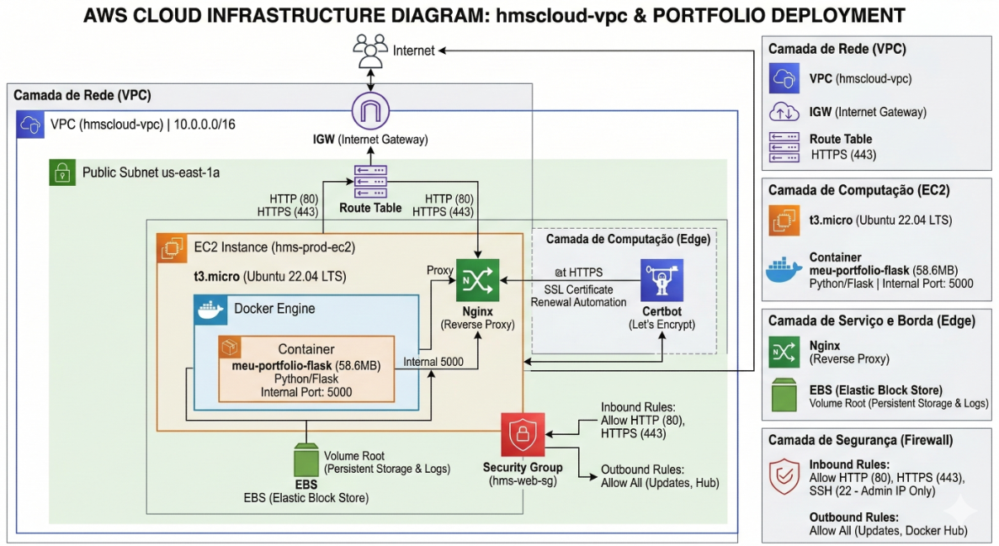

# 🏗️ HMS Cloud - Infrastructure as Code (IaC)

Este repositório é responsável pelo provisionamento e gerenciamento de toda a infraestrutura base na AWS para o projeto **HMS Cloud**, utilizando **Terraform**.

A filosofia central deste projeto é o **Desacoplamento Total**: a infraestrutura (máquinas, redes e firewalls) possui um ciclo de vida completamente independente da aplicação (código e containers). Isso garante maior resiliência, segurança e facilidade de manutenção.

---

## 🎯 Objetivos e Filosofia

- **Provisionamento Automatizado:** Infraestrutura definida como código declarativo, garantindo replicabilidade em qualquer conta AWS.
- **Filosofia DRY (Don't Repeat Yourself):** Estruturação através de módulos reaproveitáveis, evitando duplicação de configurações.
- **Segurança Default (Least Privilege):** Regras de firewall estritas, expondo apenas o estritamente necessário para o mundo externo.
- **Automação de Boot (User Data):** As instâncias nascem "prontas para combate", instalando automaticamente dependências cruciais (Docker, Nginx, Certbot) no primeiro boot.

---

## 🌐 Arquitetura da Infraestrutura

A topologia atual provisiona um ambiente robusto e isolado em uma única Availability Zone para otimização de custos, mas preparado para expansão.



### Camadas da Arquitetura:

1. **Camada de Rede (VPC):**
   - Criação de uma VPC isolada (`hmscloud-vpc` | `10.0.0.0/16`).
   - Internet Gateway (IGW) atachado e configurado na Route Table.
   - Subnet Pública operando na zona `us-east-1a`.

2. **Camada de Segurança (Firewall):**
   - **Security Group (`hms-web-sg`):** - *Inbound:* Liberação cirúrgica das portas `80` (HTTP) e `443` (HTTPS) para a web, e porta `22` (SSH) restrita ao IP administrativo.
     - *Outbound:* Liberado para comunicação da instância com a internet (Atualizações, Docker Hub).

3. **Camada de Computação (EC2):**
   - Instância `t3.micro` rodando Ubuntu 22.04 LTS.
   - Armazenamento persistente configurado via EBS (Root Volume).

4. **Camada de Automação de Borda:**
   - Script de inicialização (`user_data`) para preparar o terreno para o repositório de CI/CD: instalação autônoma de Docker Engine, Nginx (Proxy Reverso) e Certbot (Let's Encrypt para HTTPS).

---

## 📂 Estrutura do Repositório

O projeto está organizado visando escalabilidade e modularização:

```yml
portifolio_infra/
├── .gitignore
├── README.md
├── main.tf
├── providers.tf
├── variables.tf
├── outputs.tf
├── environments/
│   ├── dev.tfvars   <-- Nossa fonte da verdade para o ambiente Dev
│   └── prod.tfvars  <-- Vazio por enquanto
├── scripts/
│   └── setup_ec2.sh
└── modules/
    ├── network/
    ├── security/
    └── compute/
```

## 🚀 Como Utilizar

### Pré-requisitos
* Conta na AWS ativa.
* [tfswitch](https://tfswitch.warrensbox.com/) instalado (para gerenciamento e instalação dinâmica da versão correta do Terraform).
* AWS CLI configurado com credenciais adequadas (`aws configure`).

### Passos para Provisionamento

1. **Clone o repositório:**
   ```bash
   git clone [https://github.com/henrique-mozart-de-souza/portifolio_infra.git](https://github.com/henrique-mozart-de-souza/portifolio_infra.git)
   cd portifolio_infra

2. **Inicialize o Terraform::**
* Baixa os plugins dos provedores (AWS).
```bash
tfswitch
terraform init
```

2.1 **Gerenciamento de Ambientes (Workspaces):**
* A infraestrutura é isolada por ambientes. Crie ou selecione o workspace desejado (ex: dev ou prod).
```bash
# Para criar a primeira vez:
terraform workspace new dev

# Para selecionar em execuções futuras:
terraform workspace select dev
```


3. **Clone o repositório:**
* Gera um plano de execução mostrando tudo que será criado na nuvem.
```bash
terraform fmt
terraform validate
terraform plan -var-file="environments/dev.tfvars"
```

4. **Aplique a Infraestrutura:**
* Provisiona os recursos reais na AWS.
```bash
terraform apply -var-file="environments/dev.tfvars"
```

4.1 **Destruindo a Infraestrutura (Rollback):**
```bash
terraform destroy -var-file="environments/dev.tfvars"
```

* Desenvolvido com automação extrema por Henrique Mozart de Souza.